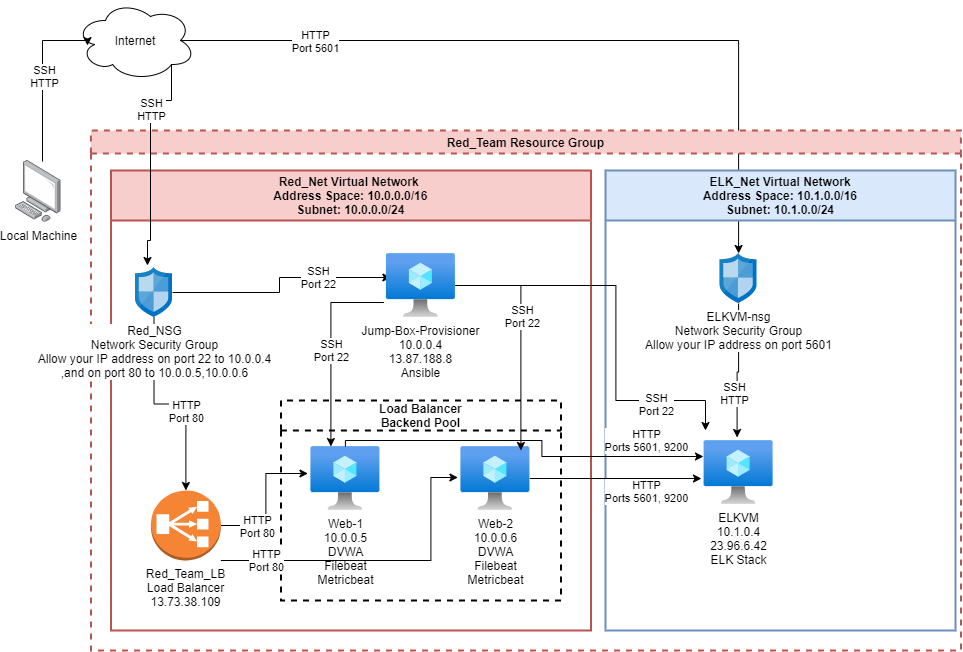

## Automated ELK Stack Deployment

The files in this repository were used to configure the network depicted below.



These files have been tested and used to generate a live ELK deployment on Azure. They can be used to either recreate the entire deployment pictured above. Alternatively, select Ansible/Playbooks files may be used to install only certain pieces of it, such as Filebeat.  I recommend going through each document searching for \#TODO\#, as these areas may be subject to change based on your particular set up.

  - Ansible/ansible.cfg
  - Ansible/hosts
  - Ansible/Playbooks/elk-playbook.yml
  - Ansible/Playbooks/filebeat-playbook.yml
  - Ansible/Playbooks/metricbeat-playbook.yml
  - Ansible/Playbooks/dvwa-playbook.yml
  - Ansible/Config/filebeat-config.yml
  - Ansible/Config/metricbeat-config.yml

This document contains the following details:
- Description of the Topology
- Access Policies
- ELK Configuration
  - Beats in Use
  - Machines Being Monitored
- How to Use the Ansible Build


### Description of the Topology

The main purpose of this network is to expose a load-balanced and monitored instance of DVWA, the D*mn Vulnerable Web Application.

Load balancing ensures that the application will be highly available, in addition to restricting access to the network.
- Load balancers protect the availability of a network by distributing incoming traffic across multiple servers. 
- Jump boxes enable administrators the ability to manage, configure, and update multiple machines from a centralized location.  This also allows for greater hardening of a single machine rather than allowing access to multiple machines, and simplifies the process of rolling out changes to the network machines.

Integrating an ELK server allows users to easily monitor the vulnerable VMs for changes to the logs and system files.
- Filebeat monitors and forwards log file data.
- Metricbeat monitors system services and resources.

The configuration details of each machine may be found below.
| Name                 | Function       | IP Address | Operating System     |
|----------------------|----------------|------------|----------------------|
| Jump-Box-Provisioner | Gateway        | 10.0.0.4   | Linux (ubuntu 20.04) |
| Web-1                | DVWA Host      | 10.0.0.5   | Linux (ubuntu 20.04) |
| Web-2                | DVWA Host      | 10.0.0.6   | Linux (ubuntu 20.04) |
| ELKVM                | ELK Stack Host | 10.1.0.4   | Linux (ubuntu 20.04) |

### Access Policies

The machines on the internal network are not exposed to the public Internet. 

Only the Jump-Box-Provisioner machine can accept connections from the Internet. Access to this machine is only allowed from your ELK machine's public IP address.

Machines within the network can only be accessed by Jump-Box-Provisioner.
- The Jump-Box-Provisioner is the only machine that can SSH into any of the other machines in the two virtual networks.
- Your IP address can access the DVWA and Kibana sites on the over ports 80 and 5601 respectively.  My IP address cannot SSH into these machines directly.

A summary of the access policies in place can be found in the table below.

| Name                 | Publicly Accessible | Allowed IP Addresses                    | Ports   |
|----------------------|---------------------|-----------------------------------------|---------|
| Jump-Box_Provisioner | No                  | [your_ELK_Machine's_Public_IP]          | 22      |
| Web-1                | No                  | 10.0.0.4,[your_ELK_Machine's_Public_IP] | 22,80   |
| Web-2                | No                  | 10.0.0.4,[your_ELK_Machine's_Public_IP] | 22,80   |
| ELKVM                | No                  | 10.0.0.4,[your_ELK_Machine's_Public_IP] | 22,5601 |

Your network security group's rules should look something like the following screen shots.  Note that access is granted per IP address.  The censored areas in the in-bound rules sections represent the public IP address of the machine you plan to use to access the network.


### Elk Configuration

Ansible was used to automate configuration of the ELK machine. No configuration was performed manually, which is advantageous because all of the network machines are uniform.  In other words, they should all behave nearly identically.  Additionally, any differences serve as indicators of compromise.

The playbook implements the following tasks:
- Install Docker and Python 3 Pip via Apt.
- Install the Docker module for Pip.
- Change the maximum available memory.
- Download and start the Docker ELK container.
- Enable the docker service on boot.

The following screenshot displays the result of running `docker ps` after successfully configuring the ELK instance.


### Target Machines & Beats
This ELK server is configured to monitor the following machines:
- 10.0.0.5
- 10.0.0.6

We have installed the following Beats on these machines:
- Filebeats
- Metricbeats

These Beats allow us to collect the following information from each machine:
- System logging information such as the /var/logs.
- System resource and service information such as CPU, memory, and disk statistics for the Docker service.

### Using the Playbook
In order to use the playbook, you will need to have an Ansible control node already configured. Assuming you have such a control node provisioned: 

SSH into the control node and follow the steps below:
- Copy the Ansible/Playbooks/elk-playbook.yml file to /etc/ansible.
- Update the hosts file to include the ELK machines local IP address.
- Ensure that the remote_user value in ansible.cfg is a valid user id on your ELK machine.
- Run the playbook, and navigate to http://[your_ELK_Machine's_Public_IP]:5601/app/kibana to check that the installation worked as expected.

Once you have connected to your Ansible container, run the following commands.  Make sure you check the hosts, ansible.cfg, and elk-playbook.yml files for the correct values before running ansible-playbook.
```console
cd /etc/ansible
curl -L -O https://raw.githubusercontent.com/sam20118/ELK_Stack/Ansible/Playbooks/elk-playbook.yml
ansible-playbook elk-playbook.yml
```

### Generating Logs

After you have set everything up, you should generate some logs to verify that data is reaching your ELK machine from your Web machines.  You can do this by running the following files:
- Scripts/WGET_Gen_Logs.sh
- Scripts/SSH_Gen_Logs.sh

Once you have generated some logs, try selecting the Logs tab on the left navigation bar.


Then try narrowing your search by enteringing *host.name:"Web-1" and event.dataset:system.auth* into the search bar.  You should see something like the following image.


Now let's try looking at the metrics. Select the Metrics tab on the left navigation bar.


You will end up at a page like this.


Now select one of the boxes in the middle of the page, which represent your Web Machines, and select *View Metrics*.


From this page you will be given information about your selected Web Machine's current resource usage.

